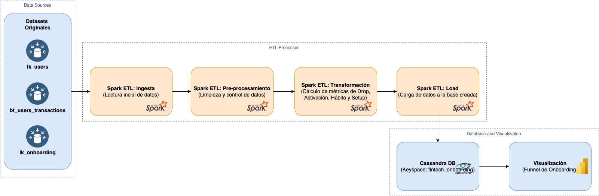

# bigdata_project_itba

📚 Descripción del proyecto
Este proyecto implementa un pipeline de Ingeniería de Datos sobre una arquitectura de Big Data para una fintech de Latinoamérica que busca reducir el abandono de usuarios en su aplicación.
El proceso completo de ETL fue desarrollado utilizando Apache Spark y Apache Cassandra, y aborda la medición de métricas de onboarding como drop, activación, hábito y setup.

## 🖼️ Arquitectura Big Data



## 🛠️ Estructura del proyecto

```plaintext
bigdata-onboarding-fintech/
├── scripts/
    ├── config/
│   │   ├── __init__.py
│   │   └── spark_session.py           # Configuración de Spark + Cassandra Connector
│   ├── ingestion.py                   # Ingesta de CSV a Parquet
│   ├── preprocessing.py               # Limpieza de datos
│   ├── transformation.py              # Cálculo de métricas de negocio
│   ├── cassandra_load.py              # Carga de datos finales en Cassandra
│   ├── check_cassandra.py             # Consulta de datos en Cassandra
│   ├── funnel_plot.py                 # Gráfico de funnel de onboarding
├── data/
│   ├── raw/                            # Archivos CSV originales
│   │   ├── bt_users_transactions.csv
│   │   ├── lk_onboarding.csv
│   │   ├── lk_users.csv
│   ├── processed/
│   │   ├── lk_users.parquet
│   │   ├── bt_users_transactions.parquet
│   │   ├── lk_onboarding.parquet
│   ├── clean/
│   │   ├── lk_users_clean.parquet
│   │   ├── bt_users_transactions_clean.parquet
│   │   ├── lk_onboarding_clean.parquet
│   │   └──
    ├── final/
│   │   └── onboarding_final.parquet
├── diagrams/
│   └── architecture_diagram.png        # Diagrama de arquitectura Big Data
├── notebooks/
│   ├── exploratory_analysis.ipynb       # Análisis exploratorio (opcional)
│   ├── pruebas_funnel.ipynb              # Notebook para el gráfico de funnel (opcional)
├── README.md                             # Documentación general
├── .gitignore                            # Archivos ignorados en el repo
└── requirements.txt                      # Dependencias necesarias

```

## 🚀 Cómo ejecutar el proyecto

1) Instalar dependencias
Instalar las librerías necesarias:

```bash
pip install -r requirements.txt
```

2) Correr los scripts en orden
Ingesta de datos CSV ➔ Parquet:

```bash
python3 scripts/ingestion.py
```

3) Preprocesamiento (limpieza de datos):

```bash
python3 scripts/preprocessing.py
```

4) Transformación de métricas de onboarding:

```bash
python3 scripts/transformation.py
```

5) Carga en Cassandra (asegurarse que Cassandra esté corriendo):

```bash
python3 scripts/cassandra_load.py
```

6) Verificación de datos en Cassandra:

```bash
python3 scripts/check_cassandra.py
```

7) Visualización del funnel de onboarding:

```bash
python3 scripts/funnel_plot.py
```

## 🧱 Requerimientos técnicos

Python 3.11

Apache Spark 3.4.1

Apache Cassandra 4.1 (corriendo en localhost)

Conector spark-cassandra-connector

Bibliotecas Python:

- pyspark

- cassandra-driver

- pandas

- matplotlib
